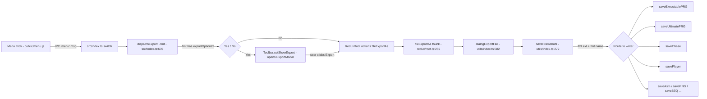
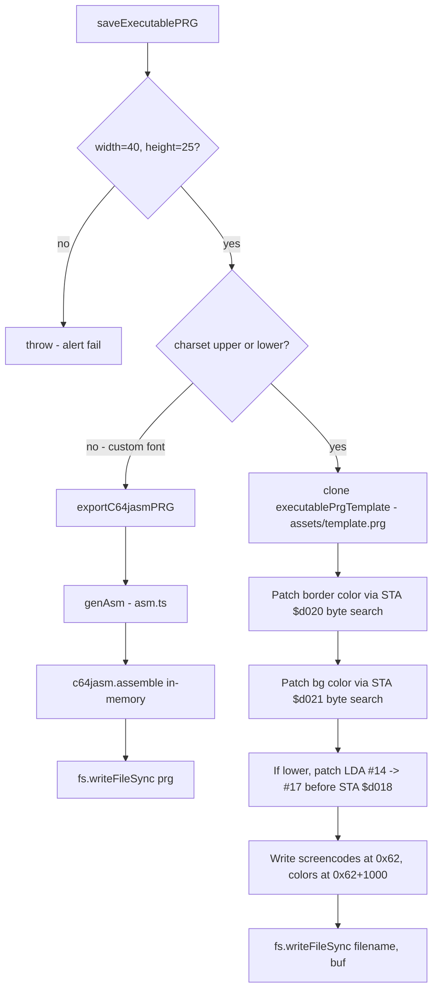
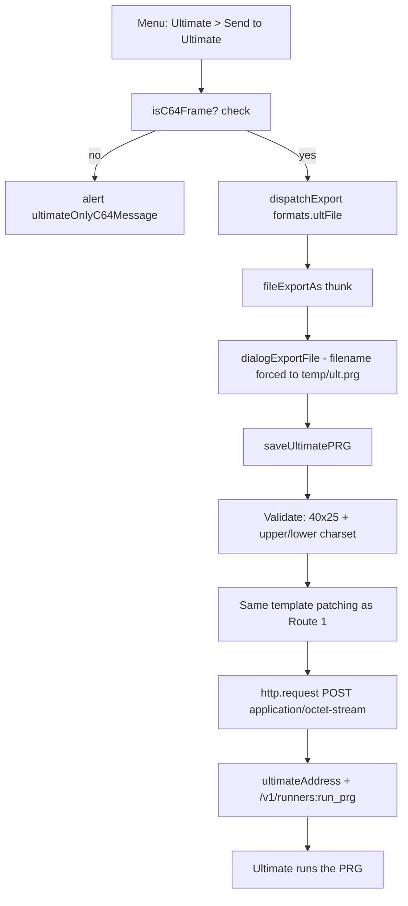
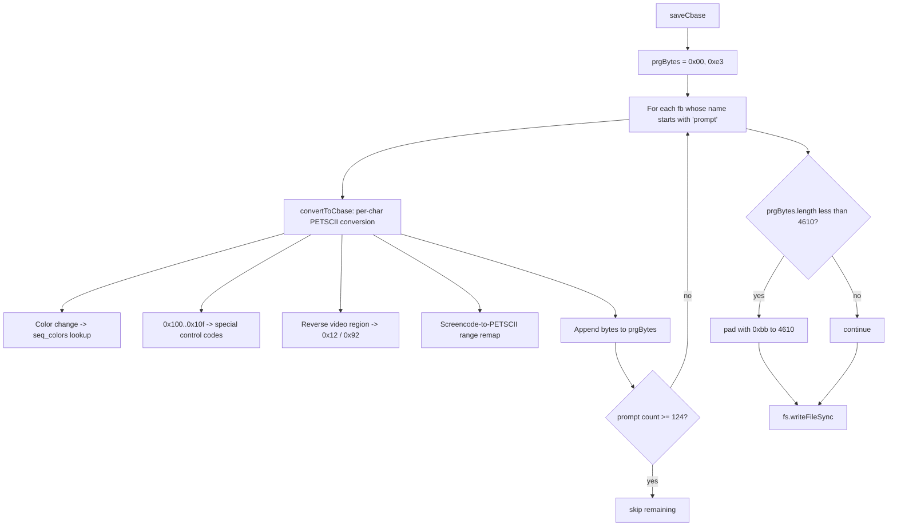
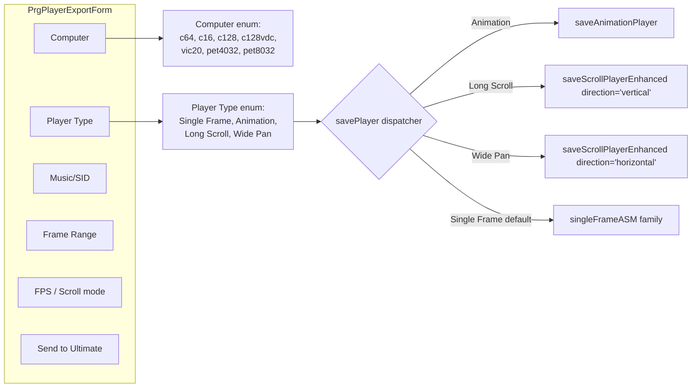
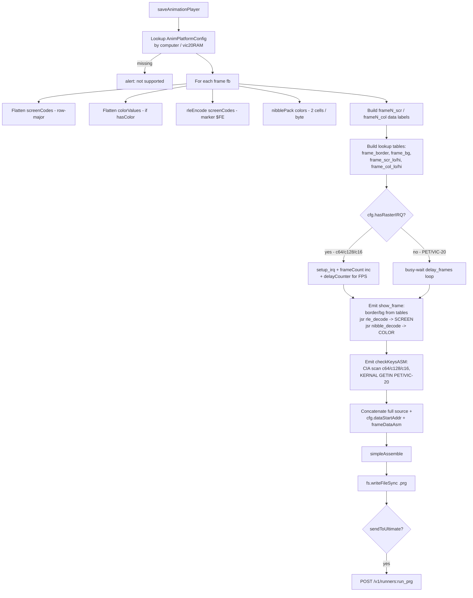
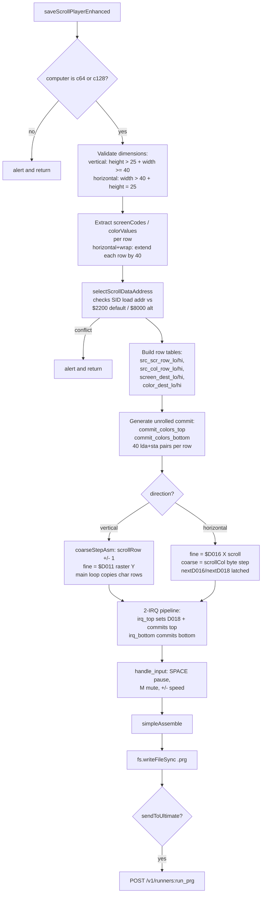
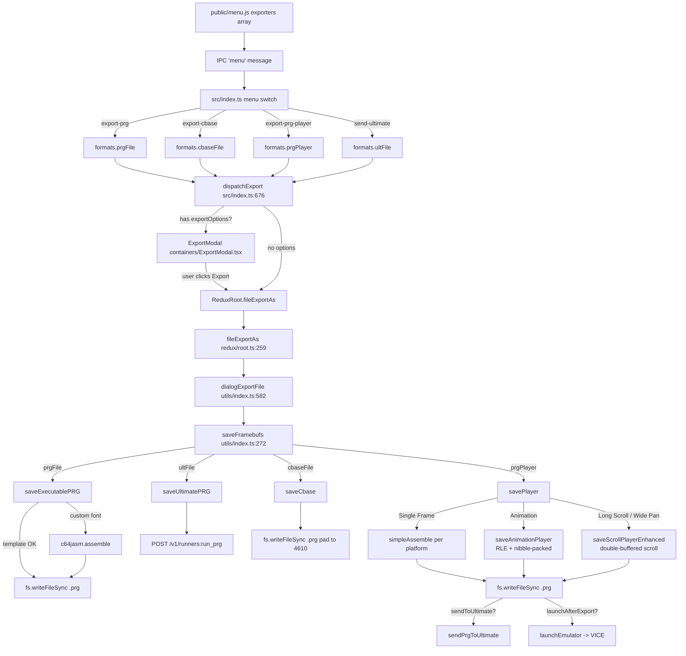

# PRG Export Flow — Petmate 9

This document reviews every code path that produces a `.prg` (Commodore
executable) file in Petmate 9. The codebase has **five** distinct PRG
export routes that each end up calling a different writer. They share a
lot of the same plumbing in the front-end (menu → modal → redux thunk),
but diverge sharply once they hit `saveFramebufs()`.

## TL;DR — the five routes

| Route key | Menu / shortcut | Exporter func | Output style |
|-----------|-----------------|---------------|--------------|
| `prgFile` | File → Export As → Executable (.prg) | `saveExecutablePRG` (`exporters/index.ts`) | C64 only — patched template *or* c64jasm fallback for custom fonts |
| `ultFile` | Ultimate → Send to Ultimate | `saveUltimatePRG` (`exporters/index.ts`) | C64 only — same template patcher, **no disk write**, POSTed to U64/U2+ HTTP API |
| `cbaseFile` | File → Export As → CBASE (.prg) | `saveCbase` (`exporters/cbase.ts`) | C-BASE BBS prompt blob — PETSCII byte stream wrapped at `$E300`, padded to 4610 bytes |
| `prgPlayer` | File → Export As → Petmate Player (.prg) — `Ctrl/Cmd+Shift+X` | `savePlayer` (`exporters/player.ts`) | c64jasm source generated per-platform, then assembled. Has 4 sub-modes (Single Frame / Animation / Long Scroll / Wide Pan) |
| `asmFile` (standalone) | File → Export As → Assembler source (.asm) | `saveAsm` → optional manual `c64jasm` build | Not a direct PRG export, but `genAsm()` is reused by `prgFile`'s c64jasm fallback |

## Top-level flow (all formats)
The Electron renderer wires every export through a single chain:

The router lives in `src/utils/index.ts (290-318)`. Note that **three
different writers share `ext === 'prg'`** so disambiguation is done by
`fmt.name` (`prgFile`, `ultFile`, `cbaseFile`, `prgPlayer`).
## Route 1 — `prgFile` (classic 40×25 C64 executable)
File: `src/utils/exporters/index.ts (213-283)`.
This is the simplest and oldest path. There are actually **two
sub-paths** inside `saveExecutablePRG`:

Key implementation detail: the template is **scanned by byte signature**
(`8d 20 d0`, `8d 21 d0`, `8d 18 d0`) so that the immediate-load operand
sitting just before each `STA` can be rewritten in place. The screen and
color RAM are blitted to fixed offsets (`0x62` and `0x062 + 1000`).
When the framebuffer uses a custom (non upper/lower) charset, the
template path can't carry the font, so it falls through to the same
in-memory c64jasm assembly the `.asm` exporter uses — `genAsm()` builds
a source string with `currentScreenOnly: true, standalone: true,
hex: true, assembler: 'c64jasm'`, and the `c64jasm` npm package
assembles it.
## Route 2 — `ultFile` (Send to Ultimate)
File: `src/utils/exporters/index.ts (284-363)`.
Triggered by the `send-ultimate` menu command in `src/index.ts:967-977`.
Same template-patch logic as Route 1, but **never writes to disk** and
POSTs the in-memory buffer to the Ultimate REST API instead:

Notable bits:
- `dialogExportFile` (`utils/index.ts:591-594`) special-cases `ultFile`
  to skip the Save dialog and write to the OS temp dir — but the buffer
  isn't actually written to disk; only the pre-patched `Buffer` is sent
  over HTTP.
- Uses Node's raw `http` module (via `window.require('http')`) instead
  of `fetch` to bypass macOS Chromium ATS/CORS restrictions on plain
  HTTP.
## Route 3 — `cbaseFile` (C-BASE BBS prompt pack)
File: `src/utils/exporters/cbase.ts`.
Completely separate format. C-BASE is a BBS package that consumes a raw
PETSCII byte stream of "prompts". Petmate stores each prompt as a frame
named `prompt*`; the exporter walks them in order, converts each
character to a PETSCII byte (with RVS-on/off, colour switches, special
keycodes for F1/F3/F5/F7, cursor keys, CLR/HOME, etc.), then pads to
exactly 4610 bytes with filler `0xbb` and prefixes a load-address
header `[0x00, 0xe3]` (load to `$E300`).

Constraints worth knowing:
- Only frames named `prompt*` are emitted — anything else is silently
  ignored.
- Hard cap of 123 prompts (the loop guards `if (promptNo < 124)`).
- The character-mapping ladder in `convertToCbase` (`cbase.ts:215-265`)
  is the canonical screencode→PETSCII converter for the BBS.
## Route 4 — `prgPlayer` (Petmate Player v1)
File: `src/utils/exporters/player.ts (668-982)` plus three large helpers
(`saveAnimationPlayer`, `saveScrollPlayerEnhanced`, and the static
`saveScrollPlayer` legacy path).
This is by far the richest route. It opens `ExportModal` →
`PrgPlayerExportForm` (`containers/ExportModal.tsx (274-530)`) for user
configuration and supports seven target machines and four player types.
### 4.1 — Modal options that drive routing

Dispatch logic at `player.ts:668-682`:
- `Animation` → slices `fbs[start..end]` and calls
  `saveAnimationPlayer`. This pipeline RLE-compresses screen codes
  and nibble-packs colour RAM (one nibble per cell), emits a
  per-platform animation runtime (raster IRQ + frame decompressor),
  and supports SID on c64.
- `Long Scroll` / `Wide Pan` → `saveScrollPlayerEnhanced`. Implements
  smooth pixel-level scrolling with double-buffered char & colour
  matrices and split raster commits. **C64 and C128 40-col only.**
  Validates that source frames are larger than 40×25 in the relevant
  axis.
- Anything else (Single Frame) falls through to the per-machine
  template branch in `savePlayer` itself.
### 4.2 — Single-Frame branches inside `savePlayer`
Each computer has its own ASM template constant at the top of
`player.ts`:
- `singleFrameASM`           → c64 / c128 (lines 33-140)
- `singleFrameC16ASM`        → c16/Plus4 (lines 143-190)
- `singleFrameVic20ASM`      → vic20
- `singleFrameC128VDCASM`    → c128 80-col VDC
- `singleFramePET8032ASM`    → PET 8032 (also reused by 4032)
The branch starting at `player.ts:698` selects:
1. The right macros file (`assets/macrosc64.asm`, `macrosc128.asm`,
   `macrosC128VDC.asm`, `macrosc16.asm`, `macrosvic20.asm`,
   `macrosPET4032.asm`, `macrosPET8032.asm`).
2. The right `charsetBits` snippet (e.g. `LDA #$15 / STA $d018` for
   C64 upper, TED `$ff13` bits for C16, VIC-20 `$9005`, etc.).
3. Whether colour RAM is included (PET branches force `color=false`).
4. Whether SID is allowed (only c64 and c128 — others force
   `music = false`).
Then `simpleAssemble(source, macrosAsm)` runs c64jasm in-memory and the
resulting `res.prg` is written to disk.
### 4.3 — Send-to-Ultimate side-channel
After `fs.writeFileSync(filename, res.prg)` succeeds, every
`saveX` writer in `player.ts` checks
`fmt.exportOptions.sendToUltimate && ultimateAddress` and, if both are
set, calls `sendPrgToUltimate(res.prg, ultimateAddress)` to POST the
buffer to `/v1/runners:run_prg`. The checkbox is gated by
`canSendPrgPlayerToUltimate` (`ExportModal.tsx:109-119`) which compares
the user's selected computer against `ultimateMachineType`.
### 4.4 — Export & Launch
If the user clicks **Export & Launch**, `handleExport(true)` flips
`launchAfterExport: true` on the format. After
`dialogExportFile` returns the saved filename, `fileExportAs`
(`redux/root.ts:300-310`) calls `launchEmulator(computer, prg,
emulatorPaths)` which spawns the configured VICE binary
(`x64sc`, `x128`, `xvic`, `xpet`, `xplus4`, …) with `-autostart prgFile`
(plus `-80` for `c128vdc`). On Windows dev builds it also has a
fallback path to `C:\C64\VICE\bin`.
### 4.5 — Animation sub-path: `saveAnimationPlayer`
File: `src/utils/exporters/player.ts (1117-1487)`.
This is the multi-frame export. Unlike Single Frame, the player must fit
*N* frames into the cartridge area for the target machine, so the
exporter compresses each frame and emits a runtime that decodes on the
fly.

**`AnimPlatformConfig`** (`player.ts:988-1087`) is the central
data-driven knob — adding a new animation target is just a matter of
filling one of these structs:
- `macrosFile` — which `assets/macros*.asm` to include.
- `hasColor` — gates colour-RAM packing/decoding entirely.
- `hasRasterIRQ` — picks IRQ-driven vs busy-wait timing.
- `canSID` — whether SID music is even attempted.
- `dataStartAddr` — origin of compressed frame data (`$2000` on
  C64/C128/C16, `$0800` on PET, `$1200` for unexpanded VIC-20).
- `bankingCode` — emitted into `entry:` (banks out KERNAL on
  C64/C128).
- `screenBytes` / `colorPackedBytes` — passed into the decoder so it
  knows how many bytes to lay down (40×25=1000, 80×25=2000, 22×23=506,
  etc.).
- `charsetSetup(cs)` — one-shot register pokes for the active charset
  (`$D018`, `$E84C`, `$FF13`, `$9005`).
- `borderBgSetup` — per-frame ASM that pulls border/bg values out of
  the lookup tables.
- `frameMeta(fb)` — returns the `(borderVal, bgVal)` actually written
  into those tables. VIC-20 packs both into a single `$900F` byte.
**Compression details:**
- `rleEncode` (`player.ts:426`): scans up to 255-byte runs; emits
  `[$FE, run, value]` whenever `run >= 4`. The literal byte `$FE`
  itself is escaped as `$FE,0` (single) or `$FE,run,$FE` (run).
- `nibblePack` (`player.ts:447`): packs two 4-bit colours into one
  byte. The matching `nibble_decode` routine (`player.ts:1413-1445`)
  is only emitted when `cfg.hasColor` — saves ~50 bytes on PET.
- `fpsToVblanks(fps)` (`player.ts:457`) converts the modal's FPS slider
  into a `delayCounter` value (raster-IRQ targets) or a busy-wait outer
  count (PET/VIC-20).
**Runtime keys:** Space toggles pause everywhere. P toggles SID mute on
C64/C128 (CIA scan, KERNAL banked out). The two key handlers live in
`checkKeysASM_CIA` and `checkKeysASM_GETIN`.
### 4.6 — Smooth-scroll sub-path: `saveScrollPlayerEnhanced`
File: `src/utils/exporters/player.ts (2183-3253)`.
This is the most ambitious path: pixel-smooth scrolling across a frame
larger than the visible area. **C64 and C128 40-col only** — the
function alerts and bails on any other computer. Long Scroll is
vertical, Wide Pan is horizontal; ping-pong and wrap modes are both
supported.

**Why it is so much code:**
- **Double-buffered character matrix.** Buffer A lives at `$0400`,
  buffer B at `$0C00`. The two `$D018` values `D018_A=$10|csBits` and
  `D018_B=$30|csBits` switch the VIC-II screen pointer mid-frame. The
  exporter unrolls a 40-cell `lda (zp_src),y / sta (zp_dst),y / dey`
  loop (`unrolledCopyRow`, `player.ts:1568`) so the entire 25-row
  character copy fits before raster line 251.
- **Single-buffer colour matrix at `$D800`.** Two raster IRQs
  (`irq_top` at line 1, `irq_bottom` at line 251) chase the beam and
  blit colour data with a separate ZP pointer (`zp_cmt_src`) so a
  commit can fire mid-character-copy without corrupting the source.
  `commit_colors_top` and `commit_colors_bottom` are both fully
  unrolled per row by `genUnrolledRow` (vertical: `genVCommitRow`).
- **Coarse + fine scroll.** `scrollFine` modulates `$D011`/`$D016`;
  `scrollRow`/`scrollCol` advance once `scrollFine` wraps. Wrap and
  ping-pong modes are different `coarseStepAsm` blocks (vertical
  ping-pong inverts `scrollDir`, horizontal mirrors).
- **Runtime input.** `handle_input` (`player.ts:2401-2486`) is a CIA
  matrix scanner with edge-detection: SPACE toggles `paused`, M toggles
  `muteFlag` (zeroes `$D404/$D40B/$D412/$D417/$D418` immediately when
  muting), `+`/`-` adjust `scrollSpeed` between 1 and 255.
- **C128 SID quirk.** When `isC128 && sid`, `sid_play` must run with
  `$FF00=$3E` (RAM bank 0) and the saved `$01` value, otherwise a SID
  inside `$D000-$DFFF` would write to I/O instead of RAM. The wrapper
  in `sidPlayMainLoopAsm` does the bank dance.
- **Memory layout** is computed defensively. `selectScrollDataAddress`
  picks `$2200` (the default) or `$8000` (the alt) for the source
  framebuf data and refuses to emit if the SID load address would
  overlap the fixed player code/vars (`$1C01-$21FF`) or the I/O hole
  (`$D000`).
## Route 5 — `asmFile` (indirect)
File: `src/utils/exporters/asm.ts`.
Strictly speaking this writes a `.asm` source file, not a `.prg`, but it
deserves mention because `Route 1`'s c64jasm fallback **calls
`genAsm()` directly** to produce a single-frame standalone source that
is then assembled in-memory. `genAsm` supports five assembler dialects
(KickAss, ACME, 64tass, ca65, c64jasm) — only the `c64jasm` dialect is
used by the in-memory fallback, but the generated `.asm` file the user
saves can target any of them.
## End-to-end map

## Cross-cutting concerns
1. **Single source of truth for format metadata** —
   `formats` in `utils/index.ts:49-205` defines every `FileFormat`
   object (name, ext, description, default `exportOptions`). Anything
   that adds a new export must register here so that `dispatchExport`
   and `saveFramebufs` find it.
2. **`saveFramebufs` ext+name disambiguation** — three formats share
   `ext: 'prg'`, so the router uses `fmt.name` as the second key. Adding
   a new `.prg` writer requires both a new branch here *and* a new
   case in the `saveFramebufs` chain.
3. **Template asset** — `assets/template.prg` is loaded once at module
   init in `utils/index.ts:493` and shared by both `saveExecutablePRG`
   and `saveUltimatePRG`. Any change to the template's STA-byte
   layout must be matched in both writers (the offsets `0x62` /
   `0x62+1000` are baked in).
4. **c64jasm assembler** — used in three places:
   - `Route 1` custom-font fallback (single in-mem source)
   - `Route 4` Single Frame (per-platform sources)
   - `Route 4` Animation / Scroll (huge generated sources)
   All three call `c64jasm.assemble` (or its `simpleAssemble` wrapper
   at `player.ts` near the helpers section) with a synthetic
   `readFileSync` that resolves `main.asm` and the macros include.
5. **Ultimate integration** is layered:
   - `ultFile` (`saveUltimatePRG`) — direct, no .prg on disk.
   - `prgPlayer` + `sendToUltimate` flag — writes .prg, **also** POSTs.
   - `d64File` + `mountOnUltimate` flag — writes .d64, mounts via
     `/v1/drives/A:mount?type=d64`, then injects keyboard buffer
     `LOAD"$",8` + `LIST`.
   - `pushToUltimate`, `sendTestPatternToUltimate`, `playSidOnUltimate`
     etc. live in `redux/root.ts` and bypass the export pipeline
     entirely.
6. **Where to add a new platform to the Player** — the radio buttons in
   `PrgPlayerExportForm.render()` (`ExportModal.tsx:497-506`), the
   `PlayerComputer` enum, the dispatcher inside `savePlayer`, and a
   matching `singleFrame*ASM` template + `assets/macros*.asm`.
## Architectural trade-offs
Reading the five routes side-by-side surfaces a few recurring tensions
that are worth flagging before any future refactor.
### 1. Disambiguation by `(ext, name)` instead of polymorphism
Every export gets routed through the giant `if/else` ladder at
`utils/index.ts:290-318`. Three formats share `ext: 'prg'`, so the
router has to check `fmt.name` as well, which means **adding a sixth
`.prg` writer requires touching five files at minimum** (`menu.js`,
`src/index.ts`, `formats` registry, `saveFramebufs` router,
`typesExport.ts` interface). A `Map<formatName, writerFn>` registry
would make this O(1) lookup and let writers self-register, at the cost
of losing the discriminated-union type narrowing TypeScript currently
gives the `if` chain.
### 2. Two completely different code-generation strategies
Route 1/2 patches a pre-built binary template; Route 4 emits c64jasm
source and assembles it at runtime. The template strategy is fast and
produces tiny, predictable PRGs but is locked to one screen layout
(40×25, two charsets, no font swap). The c64jasm strategy is
infinitely flexible but adds the `c64jasm` package as a hard dependency
and makes every Player export do real assembly work in the renderer
process. Route 1 *itself* embodies this trade-off: when the user picks
a custom font, it falls through from the fast path to the c64jasm path
automatically. Long term, retiring `template.prg` in favour of a single
cached c64jasm pipeline would simplify the codebase significantly, at
the cost of some startup performance.
### 3. Per-platform branching styles diverge inside `player.ts`
The Single Frame path uses a long `if (computer === 'c64') ... else if
(computer === 'pet4032') ...` chain (`player.ts:698-957`). Each branch
does the same flatten / push / `bytesToCommaDelimited` work then calls
a different `singleFrame*ASM` template. The Animation path replaced
that with the table-driven `ANIM_PLATFORMS` map plus
`AnimPlatformConfig`. The Scroll path is monolithic again because it
only supports two machines. Aligning Single Frame onto the same
`AnimPlatformConfig`-style table would remove ~250 lines of duplicated
frame-flattening code and unify charset-bit selection — but it is not
free because Single Frame templates have machine-specific entry-point
shapes (vic20 colour packing, c128 VDC two-pass init, etc.).
### 4. Ultimate as a side-channel rather than a writer
`sendToUltimate` is implemented inconsistently:
- `ultFile` is a *first-class* writer that POSTs and never writes a
  file.
- `prgPlayer` *also* writes a file and *additionally* POSTs after the
  fact, with the gate logic (`canSendPrgPlayerToUltimate`) living in
  the modal.
- `d64File`'s `mountOnUltimate` flag fires from inside the
  `fileExportAs` thunk in `redux/root.ts:312-342`, completely bypassing
  `saveFramebufs`.
- `sendTestPatternToUltimate`, `pushToUltimate`, `playSidOnUltimate`
  etc. live entirely in `redux/root.ts` and never touch the export
  pipeline.
The consequence is that the same HTTP helpers (`ultimateHttpRequest`,
`ultimateWriteMem`, `sendPrgToUltimate`) are implemented in three
places — `redux/root.ts:53-105`, `exporters/index.ts:332-354`, and
`exporters/player.ts:643-666`. Pulling all Ultimate I/O into a single
module (`utils/ultimate.ts`) and letting any writer optionally `await`
a ship-to-Ultimate step would remove that duplication without changing
user-visible behaviour.
### 5. Synchronous renderer-process I/O
All writers are synchronous (`fs.writeFileSync`). For Single Frame and
template-patched PRGs that's fine — they're tiny and complete in <1
ms. The Animation and Scroll paths, however, run a non-trivial c64jasm
assembly *and* a `fs.writeFileSync` on the renderer thread, which
causes noticeable jank for 100+ frame exports. Moving `simpleAssemble`
behind an Electron IPC `invoke` to the main process (or a worker) is
the obvious next step but would require shimming `c64jasm`'s
`readFileSync` callback across the IPC boundary.
### 6. Validation is scattered
Every writer re-validates dimensions and charsets in its own way:
- `saveExecutablePRG` throws on non-40×25 (Route 1).
- `saveUltimatePRG` `alert`s and returns on the same condition
  (Route 2).
- `saveD64` delegates to `validateD64Framebuf` (Route handled by
  `exporters/d64.ts`).
- `saveScrollPlayerEnhanced` has four separate `alert`s for vertical/
  horizontal × min/max conditions.
- `saveCbase` silently skips frames that don't start with `prompt`.
A shared `validateForFormat(fmt, fb)` returning a `string | null` (or
throwing a typed error) would make the modal able to disable the
Export button before launch instead of users discovering format limits
post-click.
### 7. The PRG "format" is overloaded
The `.prg` extension covers four very different artifacts in this
codebase: a static C64 screen viewer, a C-BASE BBS prompt blob, a
self-running animation/scroll demo, and an Ultimate-pushed buffer.
Each has its own implicit memory layout, load address, and runtime
assumptions. A consumer of these files has no in-band way to tell them
apart — only the filename context. The single area where this leaks is
the Cbase importer (`utils/importers/cbase2petscii.ts`), which has to
special-case `loadCbase` based on the load address being `$E300`.
Long-term, including a small magic header (or even just keeping these
on distinct extensions) would simplify the import side. Right now the
cost is concentrated in `loadFramebuf` (`utils/index.ts:413-449`),
which treats every `.prg` as Cbase by default.
## Quick reference — which file does what
- `public/menu.js` — Electron menu wiring, IPC labels, accelerators.
- `src/index.ts` — IPC `menu` listener, `dispatchExport`, post-export
  hooks for Ultimate/D64.
- `src/redux/typesExport.ts` — `FileFormatPrg`, `FileFormatUltPrg`,
  `FileFormatCbase`, `FileFormatPlayerV1` interfaces.
- `src/utils/index.ts` — `formats` registry, `dialogExportFile`,
  `saveFramebufs` router, template/font asset loading.
- `src/utils/exporters/index.ts` — `saveExecutablePRG`,
  `saveUltimatePRG`, plus the `exportC64jasmPRG` fallback and
  re-exports.
- `src/utils/exporters/asm.ts` — `genAsm`, `saveAsm`, syntax tables.
- `src/utils/exporters/cbase.ts` — `saveCbase`, PETSCII conversion.
- `src/utils/exporters/player.ts` — every Player template, RLE/nibble
  helpers, `simpleAssemble`, `sendPrgToUltimate`, `launchEmulator`.
- `src/containers/ExportModal.tsx` — UI form for every format that has
  options, plus the Send-to-Ultimate gate logic.
- `src/redux/root.ts` — `fileExportAs` thunk (kicks off everything),
  Ultimate HTTP helpers used by Routes 2 and 4 + the standalone
  Ultimate actions.
